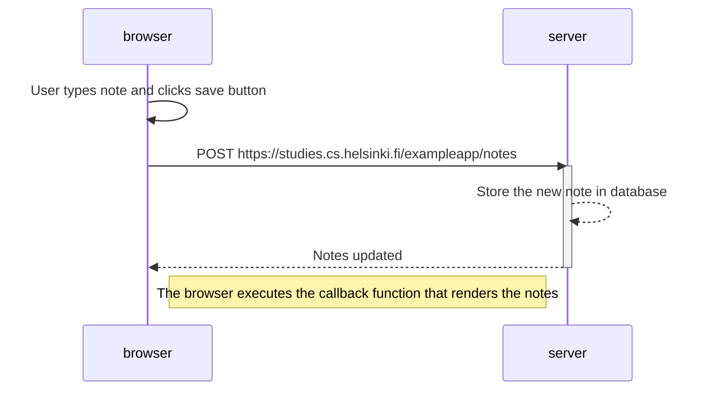

```mermaid
sequenceDiagram
    participant browser
    participant server

    browser->>browser: User types note and clicks save button
   
    browser->>server: POST https://studies.cs.helsinki.fi/exampleapp/notes
    activate server
    server-->>server: Store the new note in database
    server-->>browser: Notes updated
    deactivate server

    Note right of browser: The browser executes the callback function that renders the notes
```